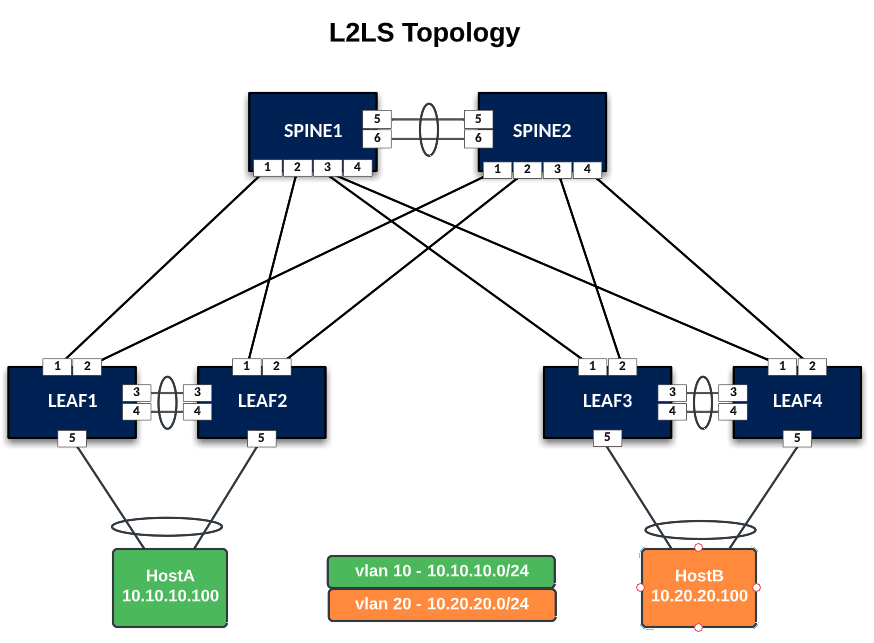
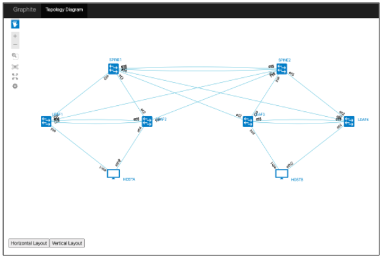
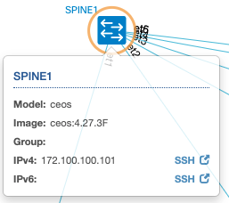
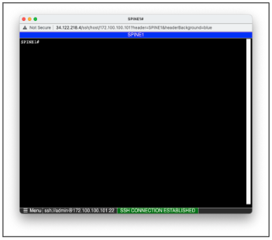

# Arista AVD/cEOS and ContainerLab Demo

This repo demonstrates Arista cEOS nodes working inside of ContainerLab

<p align="center">

</p>

## Start ContainerLab

```bash
sudo clab deploy -t containerlab/topologies/L2LS/L2LS.yaml --reconfigure
```

## Connect to your ContainerLab
Point your browser to the the public IP of your VM at this URL:

http://< VM public ip >/graphite

<p align="center">

</p>

Click on SPINE1 to connect via a web/ssh session (IPv4/SSH) link.

<p align="center">

</p>

Login with credentials:

- `username:` admin
- `password:` admin

<p align="center">

</p>

## AVD - Build and Deploy Configs

``` bash
make build deploy
```

## Connect to HostA and try pinging HostB.

```bash
admin@HOSTA:~$ ping 10.20.20.100
```

## Destroy Lab

When you are done using your lab, run the destroy command to shutdown the lab clean up docker containers.

```bash
sudo clab destroy -t containerlab/topologies/L2LS/L2LS.yaml
```
